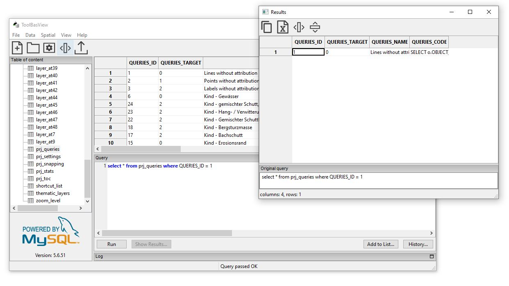

# TOOLBASVIEW #

Toolbasview allows you to open embedded MySQL databases (tables in MyISAM format). 
Its interface makes it easy to view, manipulate and export data

Toolbasview was developed as part of the ToolMap project 
(www.toolmap.ch or https://github.com/terranum-ch/ToolMap)
in order to be able to visualize, analyze and manipulate the data produced by ToolMap.

Toolbasview can also be used independently to create or work with MySQL data
without the presence of a MySQL server.

ToolbasView works on Windows, OSX and Linux and can be downloaded from the Release page,

## Build instructions

see [build instructions](help/build_instructions.md).